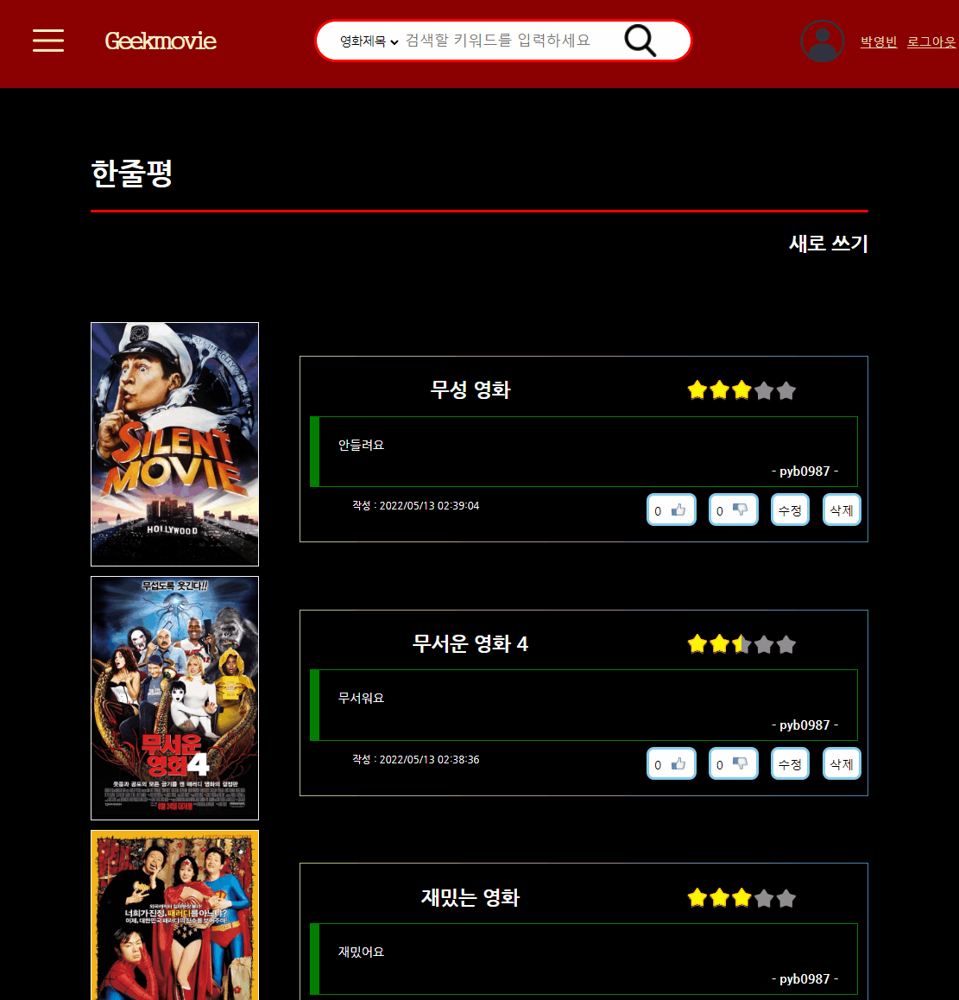
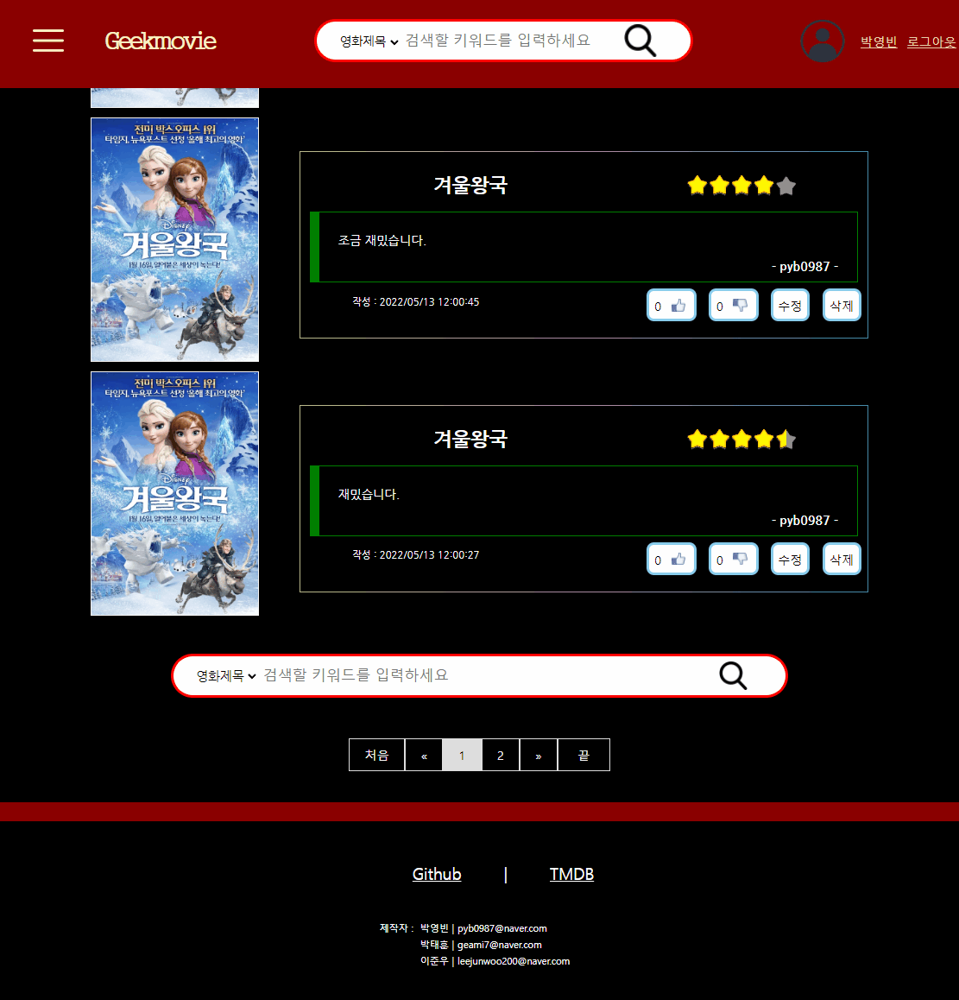
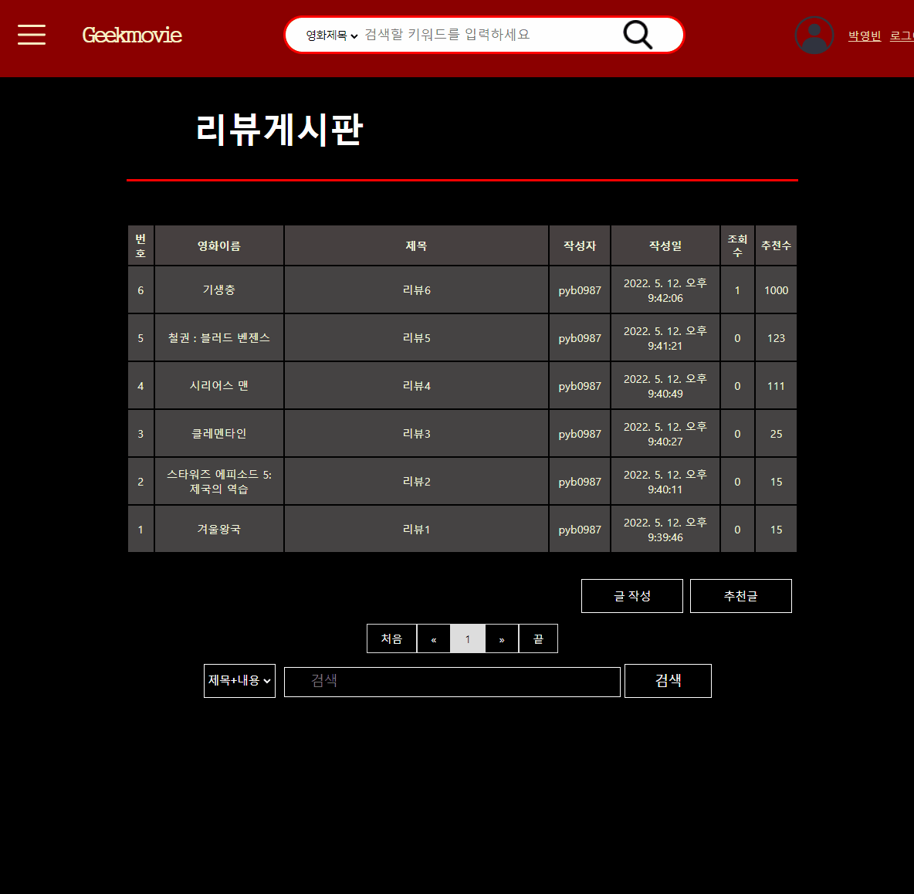
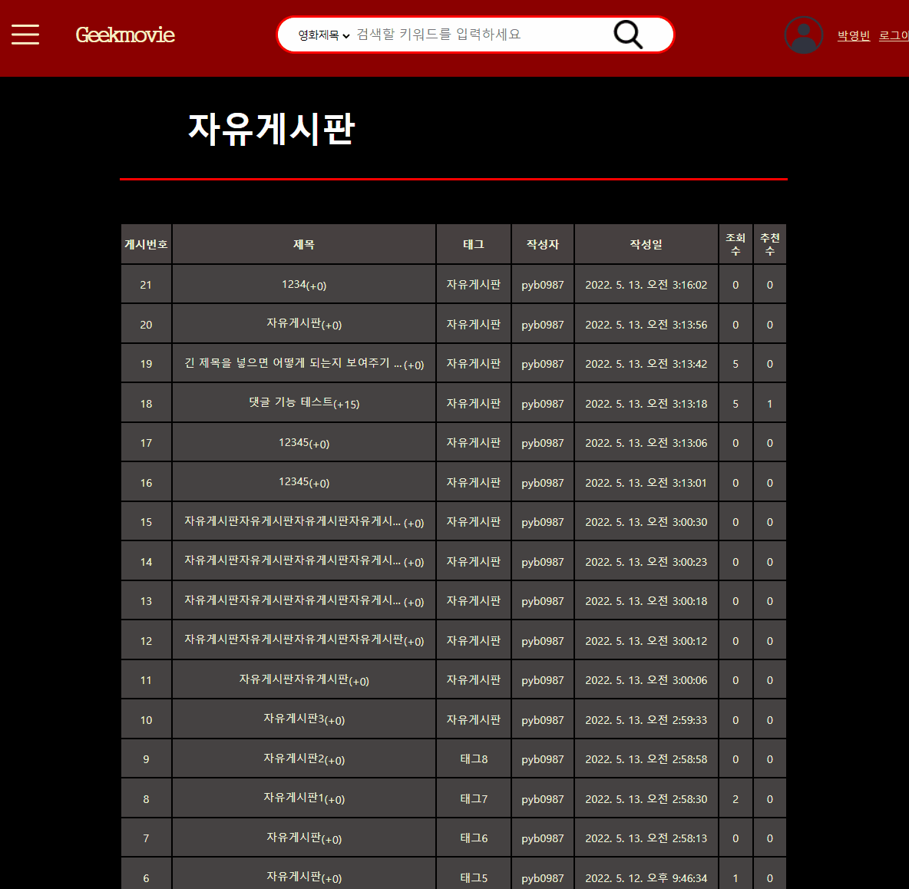
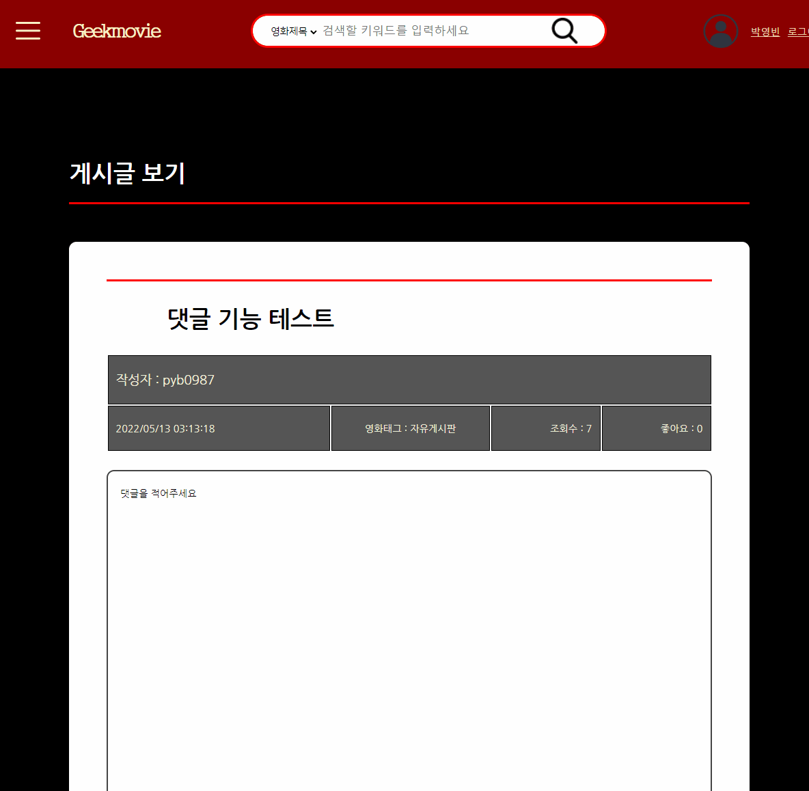

<h2># Geekmovie</h2>

<h4>TMDB 웹사이트에서 제공하는 영화정보 API를 기반으로 만든 영화 리뷰 커뮤니티 사이트입니다. 
Spring, MySQL을 이용하여 제작하였습니다.</h4>
  
ppt파일 : 영화사이트 프로젝트ppt - 0516 
ppt폰트파일 : kopub
  
제작기간 : 2022.04.17~2022.05.15(1달) 
제작인원 : 3명 
사용프레임워크 : Spring 4.2D 
DB : MySQL 
외부 DB(TMDb) api를 연동하여 영화 정보 제공  

<h5>* 메인화면</h5>

<ul>
  <li>헤더 : 검색기능, 로그인</li>
  <li>페이지 크기에 따른 폰트 및 엘리먼트 리사이징 plain script로 구현</li>
  <li>슬라이드 구현 : 레이지 로딩 적용</li>
  <li>모든 영화 포스터 : DB테이블을 연동한 좋아요와 찜기능</li>
  <li>게시글 : 추천수가 10 이상인 리뷰와 자유게시글 표시</li>
</ul>

    

<h5>* 영화 검색</h5>

<ul>
  <li>헤더에서 영화를 검색했을 때 오는 페이지</li>
  <li>검색한 쿼리와 관련된 영화 20개씩 제공</li>
  <li>페이징, 좋아요, 찜기능 구현</li>
  <li>클릭시 영화 디테일로 이동</li>
</ul>
    

<h5>* 영화 디테일</h5>

<ul>
  <li>관련영화 링크 제공</li>
  <li>외부링크의 평점과 본 사이트의 평점 제공(참여자가 3명 이상일 경우에)</li>
  <li>한줄평과 관련된 리뷰 표시</li>
</ul>
    

<h5>* 한줄평</h5>

<ul>
  <li>긴 리뷰를 작성하기 귀찮은 사용자들을 위한 기능</li>
  <li>CRUD, 좋아요, 싫어요 기능 RESTful하게 구현</li>
  <li>영화제목 검색 시, 영화를 찾을 수 있도록 모달창을 제공</li>
  <li>페이징, 검색 기능 구현</li>
</ul>
    

<h5>* 리뷰, 자유 게시판</h5>

<ul>
  <li>리뷰와 자유글을 분리한 각각의 게시판</li>
  <li>제목 및 내용, 작성자, 태그 3가지 받식의 검색</li>
</ul>
    

<h5>* 리뷰, 자유 게시판</h5>

<ul>
  <li>게시글과 댓글에 좋아요 기능을 포함</li>
  <li>RESTful하게 댓글 및 대댓글 기능 구현</li>
  <li>댓글의 계층과 페이징 기능
  <li>통상적으로 댓글 0단계는 최신순으로, 댓글 1단계 이후로는 따라 읽어나가기 쉽도록 그 반대로 정렬되는 경우가 많다는 점에 착안.
Serial Varchar field를 내림차순 정렬하여 결과 반환.</li>
<li>level 1의 댓글의 경우 Serial은 auto increment와 같음</li>
-level 2이상의 대댓글을 달 경우, 타겟에 다른 대댓글이 없다면 serial에 0001을 달고 다른 대댓글이 있다면 serial의 최댓값에 1을 더함.
-하지만 대댓글이 최대 1만개로 제한된다는 문제점이 있는데 이렇게 작성한 이유는 몇 단계에 걸치는 재귀쿼리가 비효율적이라고 생각하며, 댓글을 작성하는 것보다 보는 것이 훨씬 더 많이
일어나는 일이므로 작성할 때 create시 serial을 연산하는 것이 select시 재귀쿼리를 연산하는 것보다 훨씬 효율적이라고 생각했기 때문. 
-댓글의 최대 계층은 serial의 최대 길이를 몇자로 제한했느냐에만 영향을 받음(이 프로젝트에서는 6단계).
    </li>
</ul>

    
