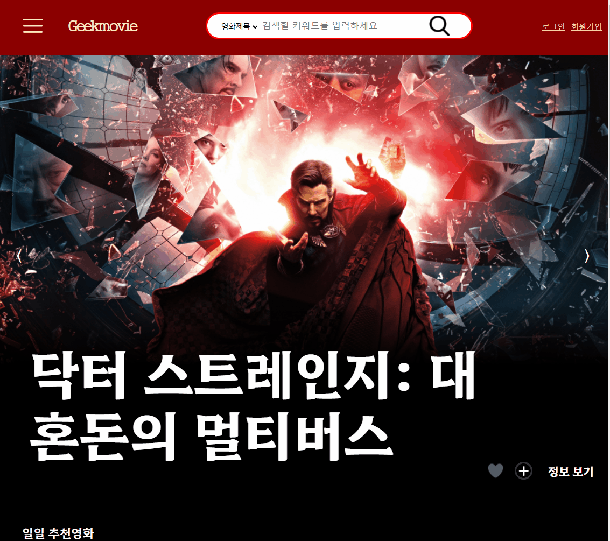

<h2># Geekmovie</h2>

<h4>TMDB 웹사이트에서 제공하는 영화정보 API를 기반으로 만든 영화 리뷰 커뮤니티 사이트입니다. 
Spring, MySQL을 이용하여 제작하였습니다.</h4>
  
ppt파일 : 영화사이트 프로젝트ppt - 0516 
ppt폰트파일 : kopub
  
제작기간 : 2022.04.17~2022.05.15(1달) 
제작인원 : 3명 
사용프레임워크 : Spring 4.2D 
DB : MySQL 
외부 DB(TMDb) api를 연동하여 영화 정보 제공  

<h5>* 메인화면</h5>

헤더 : 검색기능, 로그인 
페이지 크기에 따른 폰트 및 엘리먼트 리사이징 plain script로 구현 
슬라이드 구현 : 레이지 로딩 적용 
모든 영화 포스터 : DB테이블을 연동한 좋아요와 찜기능 
게시글 : 추천수가 10 이상인 리뷰와 자유게시글 표시 
  

<h5>* 영화 검색</h5>

헤더에서 영화를 검색했을 때 오는 페이지 
검색한 쿼리와 관련된 영화 20개씩 제공 
페이징, 좋아요, 찜기능 구현 
클릭시 영화 디테일로 이동 
  

<h5>* 영화 디테일</h5>

관련영화 링크 제공 
외부링크의 평점과 본 사이트의 평점 제공(참여자가 3명 이상일 경우에) 
한줄평과 관련된 리뷰 표시 
